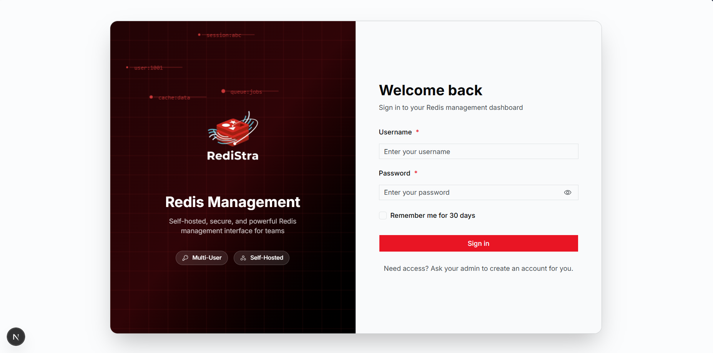
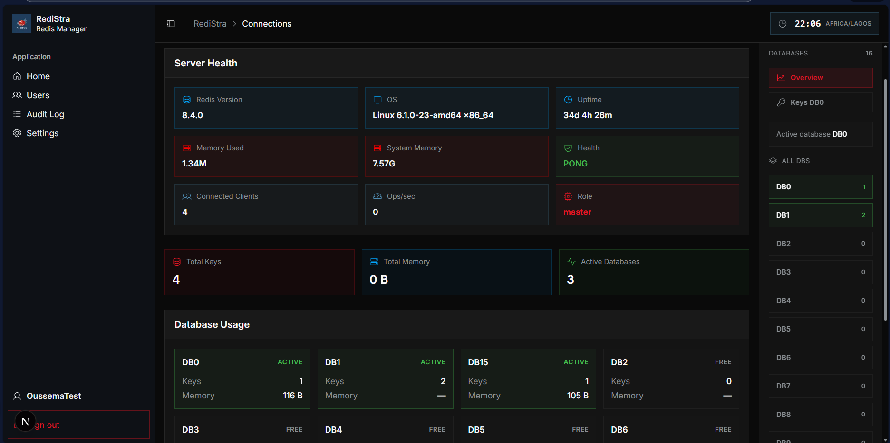
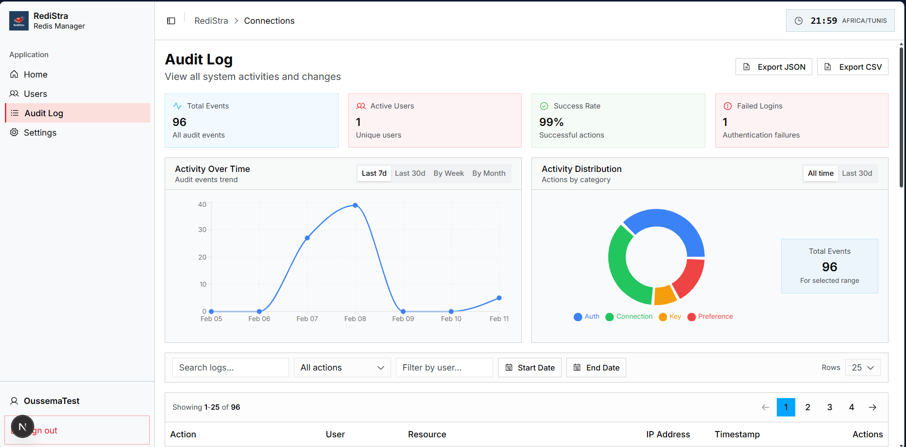
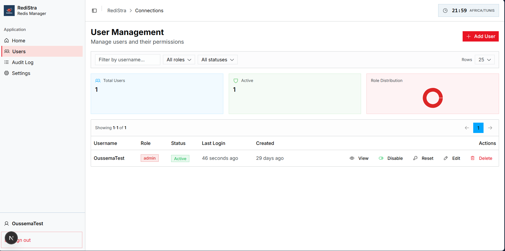
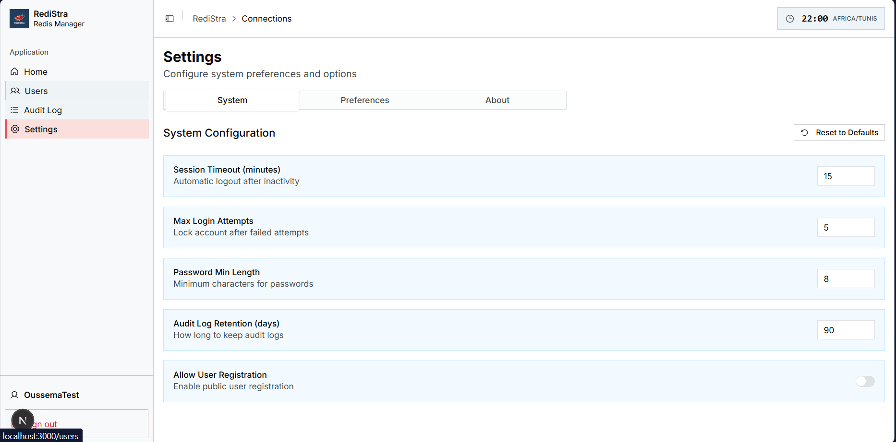
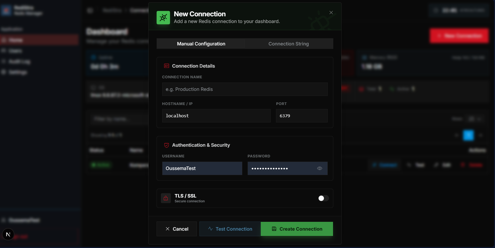
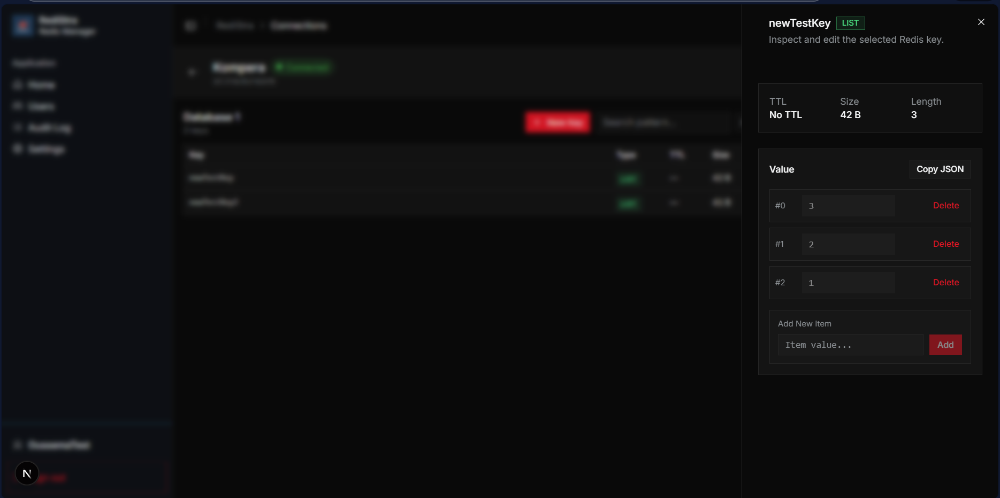
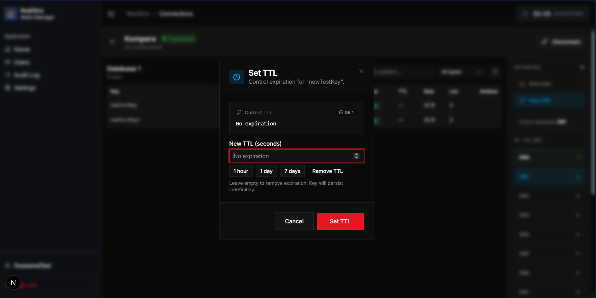

# RediStra

Hey! RediStra is a self‑hosted Redis management tool with a nice, clean UI. No more juggling CLI commands or passing around passwords — just spin it up and let your team browse keys through the browser.

It's open source, so grab it, tweak it, make it yours.

## Features

- **Multi-connection** — manage all your Redis servers in one place
- **Key browser** — search, filter by type, edit values with type-aware editors
- **Team-ready** — Admin / Editor / Viewer roles with proper access control
- **Audit log** — full activity trail with export support
- **Secure sessions** — access + refresh tokens (HTTP‑only cookies)
- **Self-hosted** — just SQLite, no external services needed
- **Single port** — one Next.js app serves both UI and API
- **Focused modals** — fast create/edit/delete flows without leaving the page

## How we compare

| Feature | RediStra | RedisInsight | Redis Commander | P3X Redis UI | Medis |
|---------|----------|--------------|-----------------|--------------|-------|
| **Web-first** | ✅ | ⚠️ Desktop + Docker | ✅ | ✅ | ❌ Mac only |
| **Built-in auth** | ✅ Required | ✅ | ⚠️ Optional | ✅ | N/A |
| **Role-based access** | ✅ 3 roles | ❌ | ❌ | ❌ | ❌ |
| **Audit logging** | ✅ | ❌ | ❌ | ❌ | ❌ |
| **Multi-user** | ✅ | ❌ | ❌ | ❌ | ❌ |
| **Simple setup** | ✅ Guided | ✅ | ✅ | ⚠️ Complex | ✅ |
| **Self-hosted** | ✅ | ✅ | ✅ | ✅ | ❌ |
| **Open source** | ✅ MIT | ⚠️ Freemium | ✅ | ✅ | ❌ Paid |

**TL;DR:** If you need **one web app, team auth, and audit logs** — that's us.

## Getting started

### Prerequisites

- **Bun 1.1+** (for development)

### Quick start

```bash
git clone https://github.com/OussemaJaouadi/redistra.git
cd redistra
bun install
cp .env.example .env
bun dev
```

Then hit `http://localhost:3000` and you're in!

### Environment variables

Copy `.env.example` to `.env` and set these:

| Variable | Description |
|----------|-------------|
| `JWT_SECRET` | Session signing key (32+ chars, random) |
| `ENCRYPTION_KEY` | Encrypts Redis passwords (exactly 32 chars) |
| `DATABASE_URL` | SQLite path (default: `./data/redis-ui.db`) |

Generate secrets:

```bash
openssl rand -base64 32
```

### Docker

```bash
docker compose up --build
```

Uses `docker-compose.yml` + your `.env`.

## Pages

| Page | What it does |
|------|--------------|
| **Setup / Login** | First admin setup + sign‑in |
| **Dashboard** | System health + all connections |
| **Connection** | Stats, databases, key browser |
| **Keys** | Browse, filter, edit, set TTLs |
| **Users** | Manage team members |
| **Audit Log** | Activity feed + charts |
| **Settings** | Preferences + about |

## Screenshots

### Core pages

| Login | Dashboard |
|-------|-----------|
|  |  |

| Connection page | Audit log |
|-----------------|-----------|
|  |  |

| Users | Settings (System) |
|-------|-------------------|
|  |  |

### Action modals

| New connection | Edit key | Set TTL |
|----------------|----------|---------|
|  |  |  |

## UI patterns (why it feels fast)

- **Dialogs (modals)** for quick actions: create connection, edit connection, delete confirmation, reset password.
- **Sheets (right drawer)** for key details and edits without losing context.
- **Compact tables** with filters, sorting, and pagination baked in.
- **Consistent feedback** with success, failure, and info toasts.

## Tech stack

| Layer | Tech |
|-------|------|
| **Frontend** | Next.js 16, React 19, Tailwind v4, shadcn/ui |
| **Backend** | Elysia (inside Next.js route handlers) |
| **Database** | SQLite via @libsql/client + Drizzle ORM |
| **Auth** | bcryptjs + JWT (HTTP‑only cookies) |

## Scripts

```bash
bun dev      # dev server
bun lint     # lint code
bun build    # production build
```

## License

MIT — free to use, tweak, and share.

Built by **Oussema Jaouadi** — https://oussemajaouadi.site
